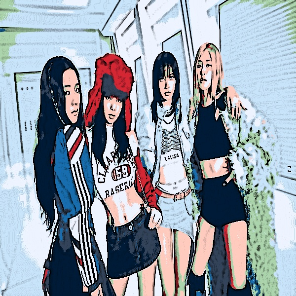

# Cartoon Vision

A computer vision project that converts real-world images into cartoon-style representations using OpenCV.

---

## Description

Cartoon Vision is a program that transforms a normal image into a cartoon-style image. It uses basic image processing techniques such as noise reduction, edge detection, and color simplification.

The final result shows clear edges and smooth, bright colors, similar to a cartoon image.

---

## Features

- Cartoon-style image transformation  
- Edge detection using Laplacian operator  
- Noise reduction using bilateral filtering  
- Color simplification through K-means clustering  
- Image sharpening for enhanced clarity  
- Brightness and saturation adjustment using HSV color space  

---

## Requirements

opencv-python  
numpy  

Install dependencies using:

pip install opencv-python numpy

---

## How to Run

1. Place your input image in the project directory  
2. Rename the file as:
input.jpg  
3. Execute the program:
python cartoon.py  
4. The processed image will be saved as:
cartoon_output.jpg  

---

## Input and Output

  
  

## Processing

The image is processed through several stages to achieve a cartoon-style effect:

1. The input image is smoothed using bilateral filtering to reduce noise while preserving edges.
2. The image is converted to grayscale for edge detection.  
3. The Laplacian operator is applied to extract prominent edges.  
4. A sharpening filter enhances important details.  
5. K-means clustering reduces the number of colors to create flat regions.  
6. Edge information is combined with the simplified image.  
7. The final result is enhanced by adjusting brightness and saturation. 

---

## Notes

- The number of clusters (K) in K-means affects the level of color simplification.  
- Lower values of K produce stronger cartoon effects, while higher values retain more detail.  
- High-resolution images generally produce better results.  
